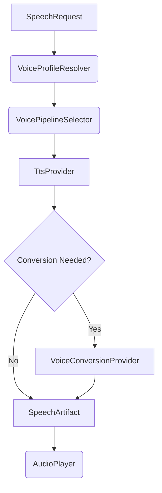

# Voice Engine Architecture

Beta's Voice Engine provides a decoupled, modular system for synthesizing speech and mapping text to character-specific voices without locking the application into a single monolithic provider.

## Core Components

The Voice Engine relies on several distinct contracts:

1. **`VoiceProfileResolver`**: Reads the character's profile (`CHARACTER.md`) and the asset provenance manifests in `var/assets/characters/<profile>/metadata/`. It resolves the trust state and availability of RVC models, Direct TTS models, and voice hints. It returns a `ResolvedVoiceProfile`.
2. **`VoicePipelineSelector`**: Decides which pipeline strategy to use based on the `ResolvedVoiceProfile.readiness_status` and the user's preference (e.g., `PipelinePreference.AUTO`). If models are untrusted or blocked, it forces a fallback to the Windows System TTS.
3. **`TtsProvider`**: An abstraction for Text-to-Speech engines. Currently implemented by `WindowsSystemTtsProvider`, which securely invokes SAPI5 via PowerShell without relying on external heavy dependencies like pyttsx3.
4. **`VoiceConversionProvider`**: An abstraction for audio-to-audio conversion (e.g., RVC). The current RVC provider only performs discovery and blocks execution, returning `ProviderNotReadyError` if called.
5. **`AudioPlayer`**: Uses standard Windows APIs (via `winsound`) to play back the generated `SpeechArtifact`.

## VoiceService Orchestration

The `VoiceService` orchestrates these contracts in a robust pipeline:

### Artifact Management

The service places intermediate TTS results in `var/artifacts/audio/intermediate/` and final results in `var/artifacts/audio/final/`. These files are tracked using `SpeechArtifact` metadata including size, checksum, and provider provenance.

### Security Boundary

- **No arbitrary `subprocess` shell execution**: PowerShell is invoked safely by writing text payloads to a `.txt` file, mitigating command injection vectors.
- **Untrusted Models**: Imported `.pth` models are marked `blocked`. The `allow_untrusted_model` CLI flag exists as an interface contract but does not bypass this block in the current milestone.
